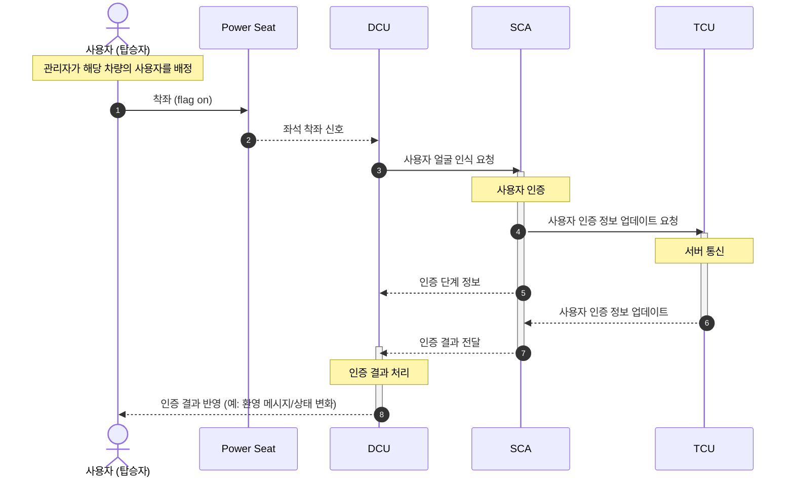

## 사용자 인증

3번 CAN 메시지 : DCU_USER_FACE_REQ (사용자 얼굴 인식 요청 CAN 메시지)

4번 CAN 메시지 : SCA_USER_INFO_REQ (사용자 인증 정보 업데이트 요청 CAN 메시지)

→ TCU가 서버에 차량 ID, 업데이트 요청 메시지 전달

→ 서버가 TCU에 차량 ID에 맞는 사용자 ID, 사용자 인증 정보(얼굴 데이터 등), 개인 프로필 데이터 전달

5번 CAN 메시지 : SCA_인증 단계 정보 주기적으로   (1. 인증 단계 정보    2. 에러 정보)

6번 CAN 메시지 :  (누락 ACK를 SCA가 보낼 수 있어야 함)

얼굴의 좌표값 (데이터 명세 민규가 작업할 예정)

ex.) 왼쪽 눈 좌표, 크기는 x, y니까 2byte

NFC byte 8개

블루투스

7번 CAN 메시지 : SCA_인증 결과 (1. 인증 결과 정보   2. 사용자 ID)