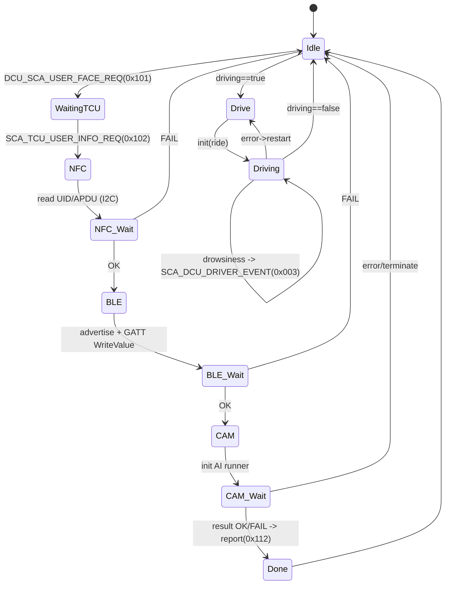

# 🚗 SCA-Core (Smart Car Access — Core)
라즈베리파이4 + MCP2515(CAN) + NFC(I²C) + BLE(DBus) 통합 인증/제어 코어

---

## ✨ TL;DR
- **플랫폼:** Raspberry Pi 4 (8GB), Debian/Raspberry Pi OS  
- **CAN:** MCP2515 SPI 모듈 (SocketCAN 자동 bring-up 지원)  
- **NFC:** I²C 모듈 사용 (SDA=GPIO2, SCL=GPIO3)  
- **BLE:** BlueZ + GDBus(GIO) 기반 Peripheral  
- **상위 API만 호출하면 동작:** `can_api` / BLE / NFC / 카메라 러너 캡슐화  
- **시퀀서(Sequencer):** NFC → BLE → CAM → 결과 보고 → 주행 모드(졸음 감지 신호)

---

## 📦 레포 구성(핵심)
```
SCA-Core/
├─ ble/                    # BLE Peripheral (BlueZ GATT + LE Advertising)
├─ camera/                 # 카메라 스크립트 실행/입출력 파일 러너
├─ nfc/                    # NFC 리더 (libnfc, ISO14443A + APDU 시도)
├─ src/                    # 라우터/시퀀서 등 실행 엔트리
├─ include/                # 공용 헤더 (CAN IDs, Sequencer 등)
├─ config/                 # 앱 설정 헤더
├─ *.cpp / *.hpp           # CAN 공용 라이브러리(어댑터/채널/메시지/공용 API)
├─ CMakeLists.txt          # 최상위 CMake
└─ README.md               # (이 파일)
```

> ✅ **Visual Studio 관련 산출물(Windows 개발 잔재)은 삭제/무시합니다.**  
> `.vs/`, `out/`, `CMakeFiles/`, `*.ipch` 등 임시 빌드/인덱스 파일은 `.gitignore`로 제외하세요.

---

## 🔌 하드웨어 연결

### 1) CAN (MCP2515 SPI, TJA1050/2515 보드)
- **전원(VCC):** 5V (라즈베리파이 5V 핀 사용)  
- **GND:** GND 공통  
- **SPI0 CE0 (CS):** GPIO8 (보드 24번 핀)  
- **SPI0 SCK:** GPIO11 (보드 23번 핀)  
- **SPI0 MOSI:** GPIO10 (보드 19번 핀)  
- **SPI0 MISO:** GPIO9  (보드 21번 핀)  
- **INT:** GPIO25 (보드 22번 핀)  
- **종단저항:** CAN H/L 양끝 120Ω 필수

> 라즈베리파이 설정(재부팅 필요): `/boot/config.txt` 또는 `/boot/firmware/config.txt`
```ini
dtparam=spi=on
dtoverlay=mcp2515-can0,oscillator=8000000,interrupt=25
```

### 2) NFC (I²C)
- **SDA:** GPIO2 (보드 3번 핀)  
- **SCL:** GPIO3 (보드 5번 핀)  
- **전원/GND:** 모듈 스펙에 맞게 연결(대부분 3.3V)  
- `raspi-config`에서 **I²C 활성화** 필요

---

## 🛠 의존성 설치 (Raspberry Pi OS / Debian)
```bash
sudo apt update

# 빌드 도구
sudo apt install -y build-essential cmake pkg-config

# CAN
sudo apt install -y libsocketcan-dev can-utils

# NFC (libnfc)
sudo apt install -y libnfc-dev

# BLE (BlueZ + GIO/GLib)
sudo apt install -y libglib2.0-dev libgio2.0-dev

# (선택) 파이썬 러너
sudo apt install -y python3 python3-venv
```

---

## ⚙️ 빌드
```bash
cd SCA-Core
mkdir -p build && cd build
cmake .. -DCMAKE_BUILD_TYPE=Release
make -j4
```

### 주요 실행물(예시)
- `rpi_can_router` : 라우터/시퀀서 통합 실행 파일  
- `test_nfc_log`    : NFC 단독 테스트  
- `test_ble_log`    : BLE 단독 테스트

---

## 🚀 실행 & 자동 bring-up

> **SocketCAN 자동 bring-up**: 라이브러리가 가능하면 `ip link set ...` 없이 인터페이스 활성화 시도합니다.

```bash
# 권한(네트워크 관리자 cap) 부여 (권장)
sudo setcap cap_net_admin+ep ./rpi_can_router

# 실행 (일반 사용자도 가능해짐)
./rpi_can_router
```

- 실행 시 **SCA 시퀀서**가 `WaitingTCU → NFC → BLE → CAM → 결과` 순으로 진행  
- 상태/결과는 CAN으로 주기/비주기 보고

---

## 🔄 시퀀서 상태 흐름


---

## 📡 CAN 데이터베이스 (SCA 관련 발췌)

| Message Name | ID | DLC | Signal | Len(bit) | Unit | Desc | SCA | TCU | DCU | 주기 |
|---|---|---:|---|---:|---|---|---|---|---|---|
| **DCU_RESET** | `0x001` | 1 | sig_flag | 1 | flag | 리셋 트리거 | Rx | Rx | Tx | 비주기 |
| **DCU_RESET_ACK** | `0x002` | 2 | sig_index/sig_status | 8/8 | byte | 1:TCU,2:SCA / 0:에러 1:OK | Tx | Tx | Rx | 비주기 |
| **SCA_DCU_DRIVER_EVENT** | `0x003` | 1 | sig_flag | 1 | flag | 졸음 이벤트 | Tx |  | Rx | 비주기 |
| **DCU_SCA_DRIVE_STATUS** | `0x005` | 1 | sig_flag | 1 | flag | 0:정지 1:주행중 | Rx |  | Tx | 비주기 |
| **DCU_SCA_USER_FACE_REQ** | `0x101` | 1 | sig_flag | 8 | flag | 얼굴 인식 개시 | Rx |  | Tx | 비주기 |
| **SCA_TCU_USER_INFO_REQ** | `0x102` | 1 | sig_flag | 8 | flag | 사용자 인증 정보 요청 | Tx | Rx |  | 비주기 |
| **SCA_DCU_AUTH_STATE** | `0x103` | 2 | step/state | 8/8 |  | 20ms 주기 상태 | Tx |  | Rx | 20ms |
| **TCU_SCA_USER_INFO** | `0x104` | 8 | index/value | 32/32 |  | Facemesh 스트림, `FFFFFFFF` 종료 | Rx | Tx |  | 비주기 |
| **TCU_SCA_USER_INFO_NFC** | `0x107` | 8 | user_nfc | 64 | bytes | NFC UID/APDU | Rx | Tx |  |  |
| **TCU_SCA_USER_INFO_BLE_SESS** | `0x108` | 6 | user_ble | 48 | bytes | BLE Service ID | Rx | Tx |  |  |
| **SCA_TCU_USER_INFO_ACK** | `0x111` | 2 | idx/state | 8/8 |  | 0:OK 1:누락 | Tx | Rx |  |  |
| **SCA_DCU_AUTH_RESULT** | `0x112` | 8 | flag/user_id | 8/56 |  | 결과/ID(분할 시 0x113 사용) | Tx |  | Rx | 비주기 |
| **SCA_DCU_AUTH_RESULT_ADD** | `0x113` | 8 | user_id | 64 | string | 유저ID 추가 페이징 | Tx |  | Rx | 비주기 |
| **프로필 업데이트(요약)** | `0x201`~`0x209` | 가변 |  |  |  | 시트/미러/핸들 + ACK |  |  |  |  |

> **유저ID 페이징**: 0x112로 다 못 싣는 경우 0x113으로 추가 전송.

---

## 🪪 NFC 구현 메모(I²C, libnfc)
- ISO14443A UID 우선, **가능 시 ISO‑DEP APDU(SELECT AID)** 시도하여 HCE 앱 응답 `0x9000` 기반 데이터 사용.
- **폴링 루프 개선**: `NP_INFINITE_SELECT=false`, `NP_TIMEOUT_COMMAND/ATR` 설정, `nfc_initiator_poll_target` 를 **짧은 주기**로 반복 호출하여 *사전 태깅 없이도* 타임아웃 동안 검출되도록 구성.
- 태그 감지 시 `nfc_initiator_deselect_target` 1회 호출 후 결과 확정, 다음 루프는 새 검출을 위해 슬립(150~200ms 권장).

---

## 📶 BLE 구현 메모(BlueZ + GDBus)
- GATT 서비스는 `"12345678-0000-1000-8000-" + <12자리 해시>`  
- Characteristic: `write` / `write-without-response` (encrypt 옵션 선택 가능)
- **광고 재등록 이슈 대응**  
  - 실패/타임아웃/종료 시 **UnregisterAdvertisement** 호출 보장  
  - `g_main_loop` 종료 전에 `done_` 플래그로 1회만 `quit`  
  - 어댑터 속성: `Powered/Discoverable/Pairable/Alias` 세팅  
  - 광고/앱 등록은 **비동기 콜백 결과를 기다려 확정**

---

## 🖼 카메라 러너 (파일 I/O 프로토콜)
- 작업 디렉토리: `SCA-AI/` (코어 바이너리 기준 상위 폴더 탐색)
- 입력: `input.txt` — `"1"(대기) → "2"(실행) → "0"(종료)`  
- 출력: `output.txt` — `'1': Ready, '2': Action, '3': Result True, '4': Result False, '0': Terminate`  
- 데이터: `user1.txt` — `uint32 float` 페어 라인들

---

## 🧪 빠른 점검(Useful Commands)
```bash
# CAN 인터페이스 확인
ip -details link show can0 || dmesg | grep -i mcp2515

# CAN 송/수신 테스트
cansend can0 123#112233
candump can0

# NFC 장치/폴링
LIBNFC_LOG_LEVEL=3 nfc-list -v

# BlueZ 어댑터 상태
bluetoothctl show
```

---

## 🧹 정리/종료 시
```bash
# 콜백/잡 해제(사용 시)
# can_unsubscribe("can0", subID);
# can_cancel_job("can0", jobID);

# 소켓/스레드 정리
can_close("can0")
can_dispose()
```

---

## 📄 라이선스
MIT (변경 가능)

---

## 🧭 버전 노트(요약)
- NFC: APDU + 폴링 안정화, 비태깅 상태에서도 타임아웃 내 검출
- BLE: 광고 재등록/미응답 시 정리 로직 강화
- CAN: SocketCAN 자동 bring-up 시도, 공용 `can_api` 캡슐화
